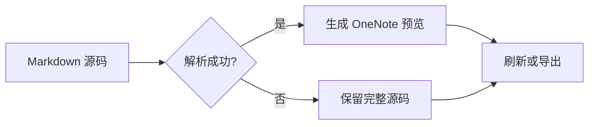
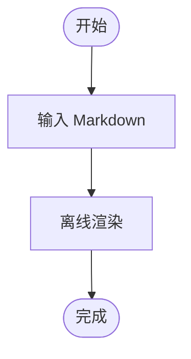
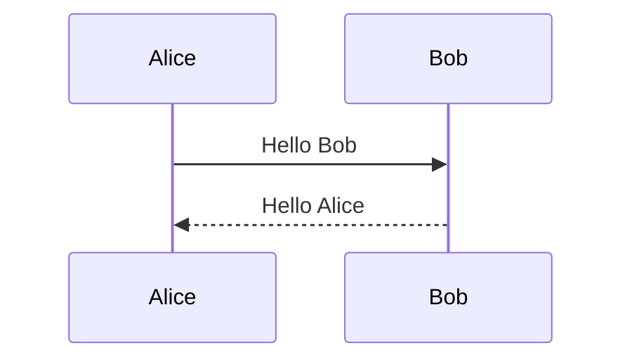

# OneNote Markdown 综合转写测试

> 测试文件版本：1.2.1-fix  
> 用途：验证 Markdown 导入、渲染、刷新、源码切换与导出往返。  
> 建议：先保留本文件副本，再分别测试“整页”“当前正文框”“选区”和“原地渲染”。

---

## 1. 标题层级

# 一级标题 Heading 1

## 二级标题 Heading 2

### 三级标题 Heading 3

#### 四级标题 Heading 4

##### 五级标题 Heading 5

###### 六级标题 Heading 6

普通段落应与标题保持清晰的字号和间距差异。

## 2. 段落、换行与 Unicode

这是第一段中文。This is an English sentence. 日本語、한국어、Español、Français、Deutsch。

这是第二段，中间有一个空行。应当保持为独立段落。

这一行末尾使用 Markdown 硬换行。  
这一行应该显示在下一行。

特殊字符：`< > & " '`；货币符号：￥ € £ $；数学符号：± × ÷ ≤ ≥ ≠ ∞；Emoji：✅ 🚀 📘。

长文本测试：OneNote Markdown 应在预览宽度内自动换行，而不应溢出正文框或截断内容。The quick brown fox jumps over the lazy dog, and this sentence is intentionally long enough to exercise wrapping behavior in a narrow side-by-side preview.

## 3. 行内格式

- **粗体 Bold**
- *斜体 Italic*
- ***粗斜体 Bold Italic***
- ~~删除线 Strikethrough~~
- `行内代码 inline_code()`
- 普通文本中混合 **粗体**、*斜体*、~~删除线~~ 和 `code`
- 转义符号：\*不是斜体\*、\#不是标题、\`不是代码\`
- 下划线文本（若不支持，应保留源码）：<u>Underline</u>
- 高亮文本（若不支持，应保留源码）：==Highlight==

## 4. 链接

- [GitHub](https://github.com/)
- [OneNote Markdown 项目](https://github.com/pczhao1210/OneNote-markdown)
- [带查询参数与片段的链接](https://example.com/search?q=markdown%20test&lang=zh#result)
- 自动链接：<https://example.com/>
- 邮件链接：[example@example.com](mailto:example@example.com)
- 无效或不安全协议应被安全处理：[不应执行脚本](javascript:alert('test'))

链接显示文字和目标地址在导入、渲染、源码切换及导出后都应保持一致。

## 5. 无序列表

- 第一项
- 第二项
  - 二级项目 A
  - 二级项目 B
    - 三级项目 B.1
    - 三级项目 B.2
- 第三项

* 星号列表第一项
* 星号列表第二项

+ 加号列表第一项
+ 加号列表第二项

## 6. 有序列表

1. 第一步
2. 第二步
   1. 子步骤 2.1
   2. 子步骤 2.2
      1. 三级步骤
3. 第三步

10. 从 10 开始的列表
11. 下一项

## 7. 混合列表与任务列表

1. 准备工作
   - [x] 安装插件
   - [x] 打开测试页面
   - [ ] 完成全部测试
2. 渲染测试
   - 普通子项
     1. 有序孙项
     2. 第二个孙项
   - [ ] 检查缩进
3. 导出测试
   - [ ] 比较原始 Markdown

## 8. 引用

> 这是一级引用。
>
> 引用中包含 **粗体**、`行内代码` 和 [链接](https://example.com/)。
>
> > 这是嵌套引用。
> >
> > - 引用中的列表项
> > - 第二个列表项

引用结束后的普通段落不应继续使用引用样式。

## 9. 分隔线与列表边界

下面是三个不同写法的分隔线：

---

***

___

以下内容必须解析为列表，而不是分隔线：

- 单个列表项
- 第二个列表项

## 10. 表格

| 左对齐 | 居中 | 右对齐 | 特殊内容 |
| :--- | :---: | ---: | --- |
| 苹果 | 10 | ¥12.50 | **加粗** |
| 香蕉 | 2 | ¥3.00 | `code` |
| 含空格内容 | 1000 | ¥1,234.56 | [链接](https://example.com/) |
| 中文与 English | 0 | ¥0.00 | A \| B |

空单元格测试：

| A | B | C |
| --- | --- | --- |
| 1 |  | 3 |
|  | 2 |  |

## 11. 代码

### 11.1 行内代码

调用 `PreviewManager.Refresh()`，并检查路径 `C:\Temp\Markdown\Test.md`。

### 11.2 C# 代码块

```csharp
using System;

public static class Greeting
{
    public static string Create(string name)
    {
        if (string.IsNullOrWhiteSpace(name))
        {
            throw new ArgumentException("Name is required.", nameof(name));
        }

        return $"Hello, {name}!";
    }
}
```

### 11.3 PowerShell 代码块

```powershell
$architectures = @("x86", "x64", "arm64")
foreach ($architecture in $architectures) {
    Write-Host "Building $architecture"
}
```

### 11.4 JSON 代码块

```json
{
  "name": "OneNote Markdown",
  "version": "1.2.1-fix",
  "architectures": ["x86", "x64", "arm64"],
  "enabled": true
}
```

### 11.5 XML 代码块

```xml
<preview id="example" position="right">
  <title>预览</title>
  <enabled>true</enabled>
</preview>
```

### 11.6 围栏长度测试

下面使用四个反引号包裹包含三个反引号的 Markdown 示例：

````markdown
```text
内部三反引号代码块
```
````

下面使用波浪号围栏；若当前版本不支持，应完整保留源码：

~~~text
tilde fenced code block
~~~

## 12. 公式

### 12.1 行内公式

质能方程为 $E = mc^2$，勾股定理为 $a^2 + b^2 = c^2$。

含分式与根号：$\frac{-b \pm \sqrt{b^2 - 4ac}}{2a}$。

### 12.2 单行块级公式

$$E = mc^2$$

### 12.3 多行块级公式

$$
\sum_{i=1}^{n} i = \frac{n(n+1)}{2}
$$

$$
\begin{aligned}
f(x) &= x^2 + 2x + 1 \\
     &= (x + 1)^2
\end{aligned}
$$

### 12.4 公式错误隔离

下列公式故意不完整，失败时应保留原公式并显示简明错误，且不影响后续内容：

$\frac{1}{$

错误公式后的普通文本仍应继续渲染。

## 13. Mermaid 图表

### 13.1 流程图



### 13.2 自上而下流程图



### 13.3 不支持的 Mermaid 语法

以下语法若未实现，应显示原因并回退为完整源码，不得静默丢失：



## 14. 图片

### 14.1 相对路径图片

下图引用仓库内的相对文件，导入本文件时应能解析：


### 14.2 远程图片

远程图片默认关闭时应明确处理；启用后才应按协议、大小和超时限制加载：


### 14.3 不存在的图片

加载失败时应保留替代文字或原始 Markdown：


## 15. HTML 与不支持语法回退

下面的 HTML 若不支持，不应被静默删除：

<div class="custom-box">
  <strong>HTML 内容</strong>
</div>

脚注语法若不支持，应保留源码：

这是一段带脚注的文本[^note]。

[^note]: 这是脚注内容。

定义列表若不支持，应保留源码：

Markdown
: 一种轻量级标记语言。

OneNote
: 微软的笔记应用。

## 16. 字符转义与边界

- 星号：\*
- 下划线：\_
- 井号：\#
- 方括号：\[text\]
- 圆括号：\(text\)
- 反斜杠：\\
- HTML 实体：&lt;tag&gt; &amp; &quot;quoted&quot;
- URL 编码：https://example.com/a%20b?q=%E4%B8%AD%E6%96%87

容易误判的内容：

2026-09-25 不是列表。

1.2.1-fix 不是有序列表。

---

- 分隔线之后的列表必须保持为列表。

## 17. `Markdown Render` 标题兼容测试

### Markdown Render

这个标题只是普通用户内容。插件不能仅凭标题文字认定它是插件生成的预览，也不能在刷新或导出时误删本节。

### 预览

这个标题同样只是普通文本，用于验证预览身份不依赖标题文字。

## 18. 往返与用户编辑测试

导入后执行以下检查：

1. 手动把预览标题改为“我的预览”，刷新后标题应继续保留。
2. 手动移动预览并调整宽度，刷新后布局应继续保留。
3. 修改预览正文，刷新时应提示冲突，而不是直接覆盖。
4. 修改源码后刷新，预览应更新且不重复追加。
5. 连续按多次 `F5`，页面上应始终只有一个关联预览。
6. 导出页面，不应同时导出源码和重复预览。
7. 切换源码时，多行渲染结果应整体恢复，不应残留。
8. 对本节的一部分文字建立不完整选区，不应退化为处理整页。

## 19. 连续编辑与自动刷新测试

快速连续修改下面的计数值，用于观察防抖和过期任务取消：

计数值：0

期望行为：

- 自动刷新开启时，连续输入只触发最终一次有效刷新。
- 切换页面后，旧页面的延迟任务不得写入新页面。
- 暂停实时模式后，不再创建新的自动刷新任务。
- 插件自身写入预览时，不应形成刷新循环。

## 20. 最终完整性检查

如果以下标记在导出文件中仍然存在，说明文件尾部此前的内容没有被截断：

`END-OF-SUPPORTED-CONTENT-1.2.1-fix`

---

## 21. 故意未闭合的代码围栏

本节必须放在文件最后。以下代码围栏故意不闭合，用于验证解析器保留不完整围栏源码且不会崩溃：

```text
INCOMPLETE-FENCE-SHOULD-BE-PRESERVED
line 2
