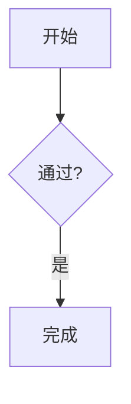

# OneNote Markdown 插件测试说明

## 1. 构建与安装

1. 执行 `powershell -ExecutionPolicy Bypass -File .\build.ps1`。
2. 按 OneNote 架构安装 `OneNoteMarkdownSetup-1.2.1-fix.1-x86.exe`、`OneNoteMarkdownSetup-1.2.1-fix.1-x64.exe` 或 `OneNoteMarkdownSetup-1.2.1-fix.1-arm64.exe`。
3. 启动 OneNote，确认 `Markdown` 功能区可见且启动无“无法顺利启动”提示。

## 2. 自动回归

`OneNoteMarkdown.Tests` 应全部通过，至少覆盖：

- 分隔线与列表优先级；
- 不同长度代码围栏；
- 单行块级 LaTeX；
- 表格和相对图片路径；
- 原地多元素源码恢复安全；
- 托管预览导出排重。

## 3. 对照预览

准备两个独立正文框，并分别输入 Markdown。

| 用例 | 操作 | 预期 |
|---|---|---|
| 整页预览 | 点击“渲染整页”，连续按三次 `F5` | 只有一个整页预览，内容原位更新，不包含旧预览 |
| 正文框预览 | 光标放入每个正文框并点击“渲染正文框” | 两个来源各自维护独立预览 |
| 选区预览 | 完整选中 Markdown 后点击“渲染选区” | 预览关联选区；无真实选区时仅提示，不处理整页 |
| 布局 | 将位置设为 `right`/`below` 并新建预览 | 预览位于来源右侧/下方，顶部或左侧对齐 |
| 保留调整 | 手动移动预览、调整宽度并刷新 | 位置和宽度保持 |
| 重置布局 | 点击“重置布局” | 整页预览按当前间距和宽度重新放置 |
| 标题 | 修改或删除标题后刷新 | 不强制恢复；隐藏标题时无空标题行 |
| 删除 | 光标置于预览并点击“删除预览” | 只删除托管预览，来源保持不变 |

## 4. 刷新、并发与关闭

1. 开启实时模式，在一行 Markdown 后快速连续回车和切页。
2. 预期：只处理最后一个有效任务，不向新页面写入旧页面结果。
3. 关闭实时模式并立即退出 OneNote。
4. 预期：无卡死，`ONENOTE.EXE` 正常退出。
5. 启用 `preview.autoRefresh=true` 后重复快速输入。
6. 预期：输入被防抖合并，只刷新活动页对照预览；不同时原地渲染同一来源。
7. 手动修改预览正文后触发自动刷新。
8. 预期：不覆盖；手动刷新时显示覆盖确认。只移动、改宽度或改标题时不提示冲突。

## 5. Markdown 内容

验证以下样例：

```markdown
# 标题

* * *

- [x] 任务
  - 嵌套项

| 名称 | 值 |
|---|---:|
| alpha | 1 |

[GitHub](https://github.com)


````csharp
```
var x = 1;
````

$$E=mc^2$$


```

预期：

- 分隔线不变成列表；
- 四反引号围栏内的三反引号不会提前关闭；
- 表格生成 OneNote 表格；
- 链接保留文字和 HTTP/HTTPS 目标；
- 导入文件的相对图片能显示；
- 单行公式成功渲染，错误公式显示原因并保留源码；
- Mermaid 流程图离线生成图片；不支持语句回退为完整围栏源码。

## 6. 导入导出

1. 导入包含标题、空行、缩进、代码、表格、公式、Mermaid 和相对图片的 `.md`。
2. 立即导出，比较 Markdown 结构和必要空行/缩进。
3. 预期：托管预览不重复导出，插件标题不导出，原始 Mermaid/公式源码保留。
4. 手动修改导入预览正文后导出。
5. 预期：提示将使用保存的原始 Markdown；取消时不产生成功结果。
6. 验证普通 OneNote 富文本采用尽力转换，不支持对象有明确提示或保留，不静默宣称完全无损。

## 7. 隐私、资源与兼容性

- 默认 `image.allowRemote=false`；确认不会请求远程图片。
- 启用后仅测试 HTTP/HTTPS，并验证 10 MB 与超时限制。
- 使用超大 Mermaid、无效公式和无效图片，确认单个失败不阻断其他块。
- 检查日志不包含笔记正文或 Markdown 源码。
- 分别验证 x86/x64/Arm64 安装包和旧 `theme.ini`；Arm64 使用 Windows 11 + .NET Framework 4.8.1，缺失新键时使用默认值。
- 标题恰好为 `Markdown Render` 的普通正文框不得被自动认领或删除。

## 8. 结果记录

```text
测试时间：
OneNote 版本与位数：
系统版本：

启动/退出：
整页/正文框/选区预览：
刷新取消与冲突：
表格/链接/图片：
公式/Mermaid：
导入导出：
x86/x64：
日志隐私：

失败现象与日志摘要：
```
